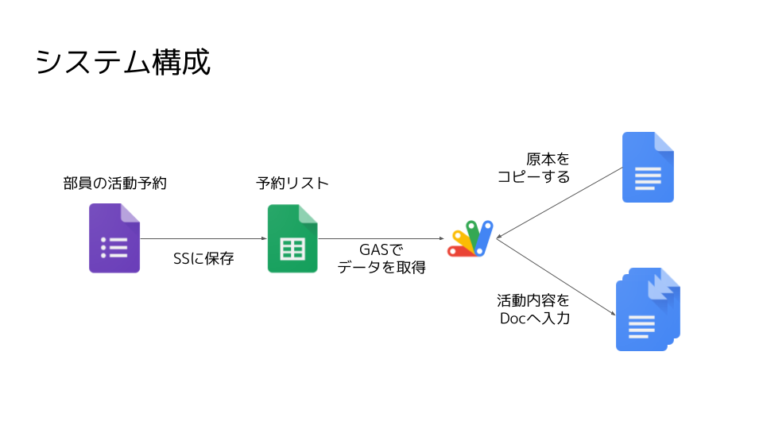

# circle-dx
サークル活動に必要な書類の作成を自動化するプログラム

## プログラムの使い方
活動した人がフォームに必要な情報を入力すると、仕様変更後というフォルダにGoogleドキュメントが作られていきます。  
提出責任者(部長や他の役員)はドキュメントをWord形式で書き出して、教務課にメールで提出してください。  

## プログラムの構成
Googleフォーム(以下フォーム)とGoogleスプレッドシート(以下スプレッドシート)とGoogle Apps Script(以下GAS)で構成されています。  
  

プログラムの振る舞いは以下の通りです。  
1. フォームに情報が入力される。
2. スプレッドシートに回答が記述される。
3. 回答が記述されると、スプレッドシートに紐づいているGASが実行され、活動届が作成される。

## プログラムの停止/再開方法
フォームの回答を締め切ることで停止できます。  
逆に、回答を再開すればまたプログラムが動きます。  

## 注意点
2021年11月(コロナ禍)時点での活動届用に作成しているので、活動人数は5人までしか対応していません。  

## GASについて(プログラムちょっとわかる人向け)
新サークル活動届(回答)→拡張機能→Apps Scriptから、プログラムのソースコードを編集できます。  
JavaScriptを書けるならGASも書けると思うので、活動届の仕様変更やバグなどがあった場合は適宜アップデートしてください。  
[GASのリファレンス](https://developers.google.com/apps-script/reference)が参考になると思います。    
俺ならもっと綺麗なコード書けるわwって方がいたらぜひリファクタリングをお願いします。  
